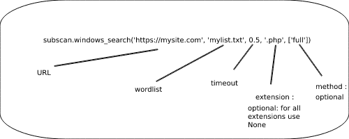

# SubScan

SubScan is a script and a Python module that is used to find directories and subdomains of a web site using word lists, scan the ports of a machine, retrieve the route of a request...

SubScan has two main functions one for listing directories of a website on Windows that does not have an anonymous mode and one for listing directories of a website on Linux that has an anonymous mode.
<h1>Installation</h1>

  You can install it with  **:**  ```pip install --upgrade SubScan```
  
  
<h1>Linux version</h1>

  <h2>To use the linux version you must install tor with the following command</h2>
  
  ```sudo apt-get install tor```
  
  <h2>Configuration</h2>
  
  
  
  1) ```tor --hash-password yourpassword```
  
  2) Copy the result
     
  3) With linux terminal run this command

  ```sudo python3 subscan.py -tp -p yourpassword -h yourhashedpassword```
  
 
<h1>Terminal commands</h1>
  
  ```python3 subscan.py -find -u https://github.com/ -w dl.txt [-f] [-e .php]``` --> List the directories of a website with method full
  
  ```python3 subscan.py -scan -i 0.0.0.0 [-r 1-9000] [-t 0.2] [-tn 20]``` --> List the open ports between 1 and 9000 on host 0.0.0.0 with a timeout of 0.2 and 20 threads 
  
  ```python3 subscan.py -ip -u google.com``` --> Get the server ip of the web page
  
  ```python3 subscan.py -dns -u https://google.com/ -w dl.txt [-f]``` --> List the subdomains of a website with method full
  
  ```python3 subscan.py -route -u https://google.com/``` --> List the routes of the url
  
<h1>SubFinder Python Module</h1>

  <h2>First step import the module</h2>
  
  ```from SubScan import subscan```

  <h2>Windows commands</h2>

   Anonymous mode : ***No***

   
                                                    
  <h2>Linux commands</h2>

   Anonymous mode : ***Yes***

  
                                                    
                                                    
  *The 'full' method is used to display all requests.* 
  
  <h2>Host discovery</h2>
  
   <h3>Ports scan</h3>
   
   Use this command to scan the ports of a machine
   
   ``subscan.scan_ports('ip', 'search_range', timeout, thread_number)``
   
   *Ex :* 
   ``subscan.scan_ports('0.0.0.0.0', '1-8000', 1, 20)``

   <h3>Get ip</h3>
  
   Use this command to retrieve the server **ip** of a link **:** 
  
  ```subscan.get_host_ip('mysite.com')```
  
  <h2>Specials commands</h2>
  
  The special commands are used to retrieve the list of valid site directories without displaying them.
  
  <h3>Specials commands for Windows</h3>
  
  Anonymous mode : ***No***
  
  ```
  r = subscan.windows_search_NP('https://mysite.com', 'mylist.txt', 0.5, '.log')
  print(r) #This line will display the list of valid directories once the search is complete
  
  ```
  
  <h3>Specials commands for Linux</h3>
  
  Anonymous mode : ***Yes***
  
  ```
  r = subscan.linux_search_NP('https://mysite.com', 'mylist.txt', 0.5, '.log')
  print(r) #This line will display the list of valid directories once the search is complete
  
  ```
  
  ❗ *For special commands there is no method* ❗
