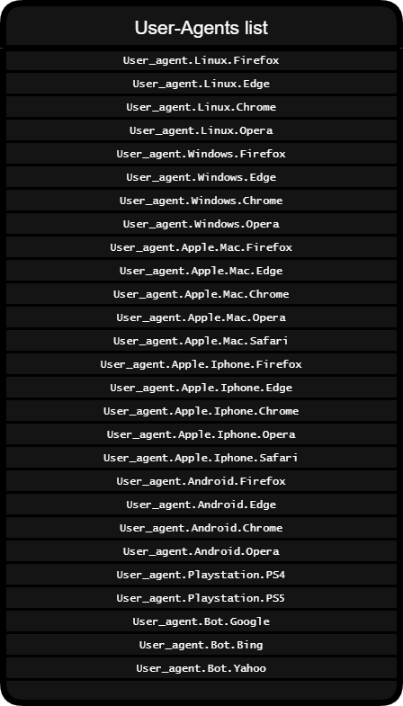

# SubScan

SubScan is a script and a Python module that is used to find directories and subdomains of a web site using word lists, scan open ports on a machine, retrieve route of a request...

SubScan has two main functions: one to list directories of a website on Windows (no anonymous mode) and another to list directories of a website on Linux that (with anonymous mode).

<h1>Installation</h1>

  You can install it with  **:**  ```pip install --upgrade SubScan``` on windows, ```sudo pip install --upgrade SubScan``` on linux
  
  
<h1>Linux version</h1>

  <h2>To use the linux version you must install tor with the following command</h2>
  
  ```sudo apt-get install tor```
  
  <h2>Configuration</h2>
  
  1) With linux terminal run this command

  ```sudo python3 SubScan_shell.py -tp -p yourpassword```
  
 
<h1>Terminal commands</h1>
  
  ```python3 SubScan_shell.py -find -u https://github.com/ -w dl.txt [-a User_agent.Android.Edge] [-f] [-e .php]``` --> List directories of a website with method full
  
  ```python3 SubScan_shell.py -scan -i 0.0.0.0 [-r 1-9000] [-t 1] [-tn 2]``` --> List open ports between 1 and 9000 on host 0.0.0.0 with a timeout of 0.2 and 20 threads 
  
  ```python3 SubScan_shell.py -ip -u google.com``` --> Get the server ip of the web page
  
  ```python3 SubScan_shell.py -dns -u https://google.com/ -w dl.txt [-a User_agent.Android.Edge] [-f]``` --> List subdomains of a website with method full
  
  ```python3 SubScan_shell.py -route -u https://google.com/ [-a User_agent.Android.Edge]``` --> List routes of the url
  
<h1>SubFinder Python Module</h1>

  <h2>First step : import the module</h2>
  
  ```import SubScan```

  <h2>Windows commands</h2>

   Anonymous mode : ***No***

   SubScan.windows_search(*url, wordlist, timeout, extension [optional], user-agent[optional], method [optional]*)
   
   Example :
   ```SubScan.windows_search('https://mysite.com', 'mylist.txt', 0.5, '.php', SubScan.User_agent.Linux.Opera, 'full')```
                                                    
  <h2>Linux commands</h2>

   Anonymous mode : ***Yes*** (Based on Tor)

   SubScan.linux_search(*url, wordlist, timeout, extension [optional],  user-agent[optional], method [optional]*)
   
   Example :
   ```SubScan.linux_search('https://mysite.com', 'mylist.txt', 0.5, '.php', SubScan.User_agent.Linux.Opera, 'full')```
                                                    
                                                    
  *The 'full' method is used to display all requests.* 
  
  <h2>Host discovery</h2>
  
   <h3>Ports scan</h3>
   
   Use this command to scan open ports on a machine
   
   ``SubScan.scan_ports('ip', 'search_range', timeout, thread_number)``
   
   *Ex :* 
   ``SubScan.scan_ports('0.0.0.0.0', '1-8000', 1, 2)``

   <h3>Get ip</h3>
  
   Use this command to retrieve the server **ip** of a link **:** 
  
  ```SubScan.get_host_ip('mysite.com')```
  
  <h3>Subdomains finder (based on word list)</h3> 
  
  
   ```SubScan.DNS_enum('https://google.com', 'test.txt', 0.1, SubScan.User_agent.Linux.Opera, 'full')```
  
  
  <h2>Special commands</h2>
  
  The special commands are used to retrieve the list of valid site directories without displaying them.
  
  <h3>Special commands for Windows</h3>
  
  Anonymous mode : ***No***
  
  ```
  r = SubScan.windows_search_NP('https://mysite.com', 'mylist.txt', 0.5, '.log', SubScan.User_agent.Linux.Opera)
  print(r) #This line will display the list of valid directories once the search is complete
  
  ```
  
  <h3>Special commands for Linux</h3>
  
  Anonymous mode : ***Yes***
  
  ```
  r = SubScan.linux_search_NP('https://mysite.com', 'mylist.txt', 0.5, '.log', SubScan.User_agent.Linux.Opera)
  print(r) #This line will display the list of valid directories once the search is complete
  
  ```
  
  <h3>Here is the list of User-Agents</h3>

  
  
  ❗ *For special commands there is no method* ❗
